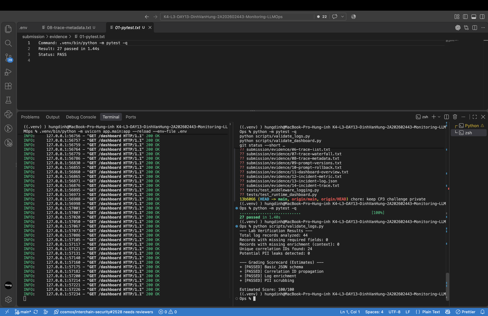
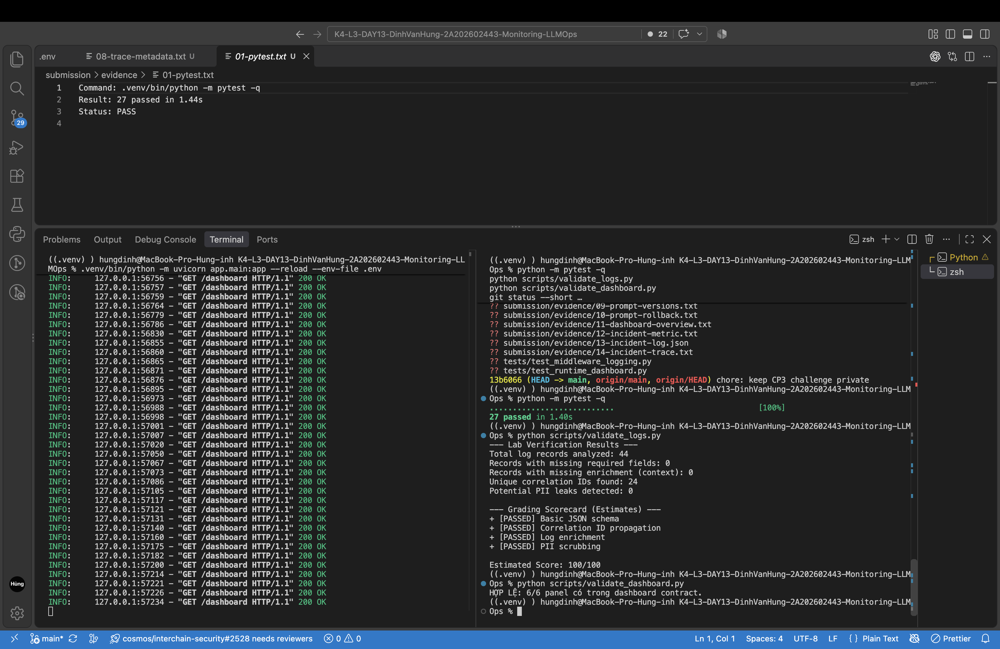
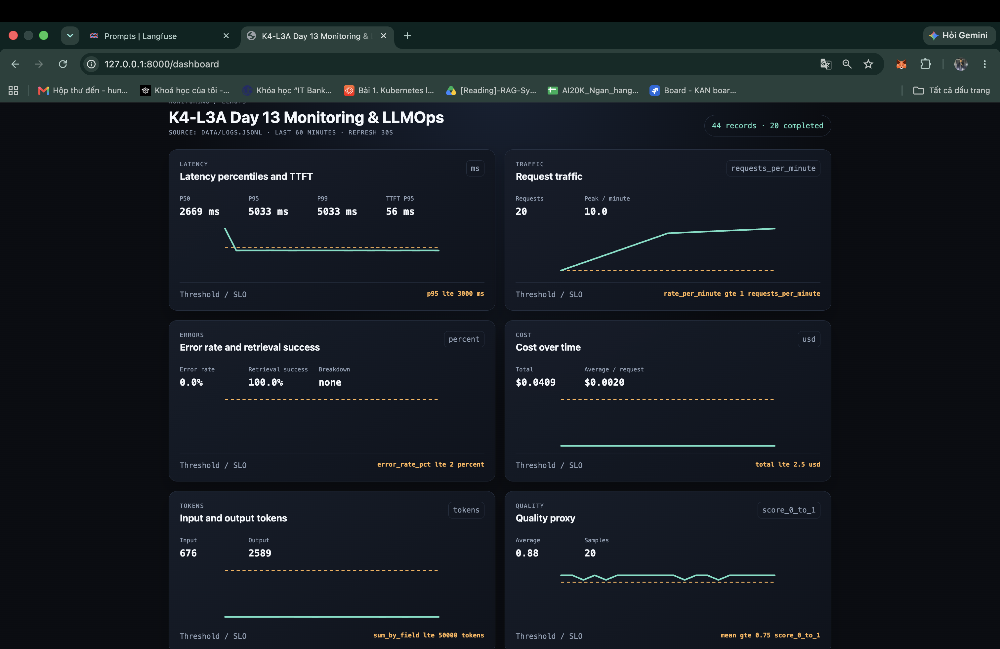
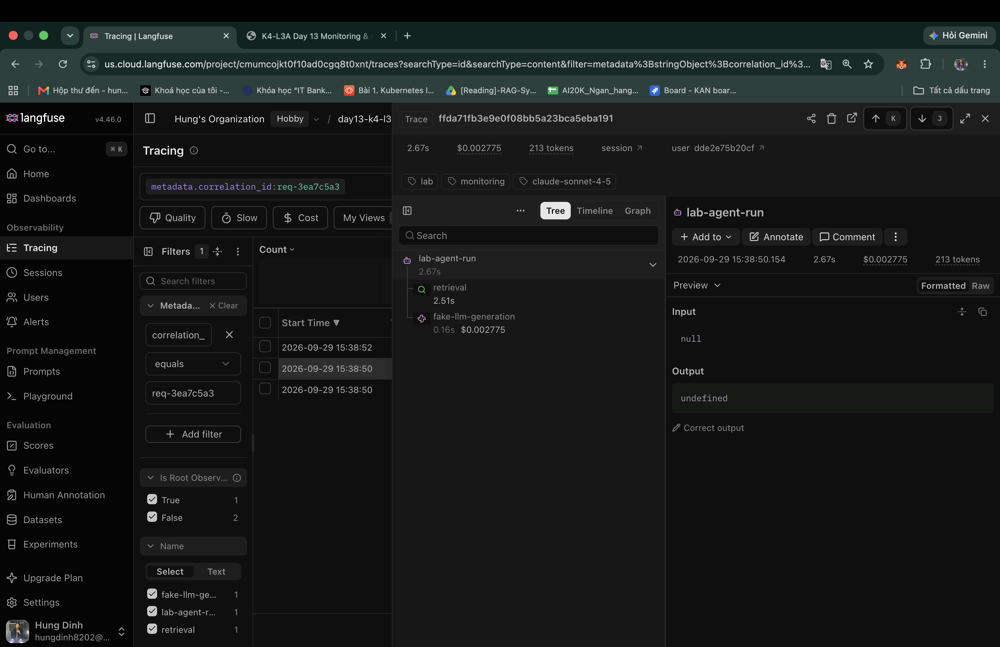

# Báo cáo cá nhân — K4-L3A Day 13 Monitoring & LLMOps

> Mỗi học viên hoàn thiện một file duy nhất này. Khi dẫn evidence, dùng đường dẫn tương đối, ví dụ `evidence/07-trace-waterfall.png`.

## 1. Thông tin học viên

- **Họ và tên:** Đinh Văn Hùng
- **MSSV:** 2A202602443
- **Lớp:** K4-L3A
- **Repository URL:** https://github.com/hungdinh82/K4-L3-DAY13-DinhVanHung-2A202602443-Monitoring-LLMOps
- **Commit SHA chứa source và evidence:** `dbef0c4` (`feat: complete LLMOps monitoring submission`); SHA nộp cuối là `HEAD` trên remote `main` sau commit báo cáo này.
- **Challenge ID:** `day13-k4-l3a-monitoring-llmops-v1`
- **Tên project Langfuse cá nhân:** `day13-k4-l3a-2A202602443`

## 2. Evidence index

Điền đúng đường dẫn tới evidence thực tế. Có thể đổi tên hoặc dùng nhiều ảnh nếu cần.

| Evidence | Đường dẫn |
|---|---|
| Pytest cuối | [`evidence/01-pytest.txt`](evidence/01-pytest.txt) |
| Log validator | [`evidence/02-log-validator.png`](evidence/02-log-validator.png) |
| Dashboard validator | [`evidence/03-dashboard-validator.png`](evidence/03-dashboard-validator.png) |
| Structured log | [`evidence/04-structured-log.png`](evidence/04-structured-log.png) |
| PII redaction | [`evidence/05-pii-redaction.png`](evidence/05-pii-redaction.png) |
| Trace list | [`evidence/06-trace-list.png`](evidence/06-trace-list.png) — tên project cá nhân và hơn 10 traces |
| Trace waterfall | [`evidence/07-trace-waterfall.png`](evidence/07-trace-waterfall.png) |
| Trace metadata | [`evidence/08a-trace-generation.png`](evidence/08a-trace-generation.png), [`evidence/08b-trace-metadata.png`](evidence/08b-trace-metadata.png) |
| Prompt versions | [`evidence/09-prompt-versions.png`](evidence/09-prompt-versions.png) |
| Prompt rollback | [`evidence/10-prompt-rollback.png`](evidence/10-prompt-rollback.png) |
| Dashboard runtime | [`evidence/11-dashboard-overview.png`](evidence/11-dashboard-overview.png) |
| Incident metric | [`evidence/12-incident-metric.png`](evidence/12-incident-metric.png) |
| Incident log | [`evidence/13-incident-log.png`](evidence/13-incident-log.png) |
| Incident trace | [`evidence/14-incident-trace.png`](evidence/14-incident-trace.png) |

## 3. Kết quả kỹ thuật

| Nội dung | Baseline | Kết quả cuối | Nhận xét |
|---|---|---|---|
| `validate_logs.py` | 30/100 | 100/100 | Không thiếu schema, enrichment hoặc correlation ID |
| `validate_dashboard.py` | 6/6 panel hợp lệ | 6/6 panel hợp lệ | Dashboard contract và runtime `/dashboard` có đủ sáu panel |
| `pytest` | 22 passed | 27 passed | Chạy bằng Python 3.12.10, pytest 8.3.5 |
| Số traces hợp lệ | 10 | 35 | Đã xác nhận trace tree root/retrieval/generation qua Langfuse Observations API |
| Số PII leak | 0 | 0 | Không phát hiện PII thô trong 22 log records CP1/CP2 |
| Latency P95 / TTFT P95 | 1166 ms / 55 ms | 1205 ms / 57 ms | Đo trên workload CP1/CP2 có bật Langfuse tracing |
| Retrieval success rate | 100% | 100% | 11/11 requests CP1/CP2 trả HTTP 200 và retrieval thành công |

## 3.1. Evidence ảnh chính

## 4. Logging và PII

- **Cách tạo/nhận và truyền correlation ID:** Middleware clear context ở đầu mỗi request, ưu tiên header `x-request-id`; nếu thiếu thì sinh `req-<8-hex>`, bind vào structlog, `request.state`, JSON response và hai response header `x-request-id`/`x-response-time-ms`.
- **Các metadata được ghi vào structured log:** `correlation_id`, `user_id_hash`, `session_id`, `feature`, `model`, `env`, cùng latency, TTFT, token, cost, quality và retrieval status trên event tương ứng.
- **Cách bảo đảm PII được scrub trước khi ghi:** Processor `scrub_event` duyệt đệ quy mọi string trong event dict và chạy trước `JsonlFileProcessor`/`JSONRenderer`; user ID chỉ được ghi dưới dạng SHA-256 rút gọn.
- **Cách kiểm chứng kết quả:** Gửi sample chứa email, điện thoại Việt Nam, CCCD và thẻ; tìm raw value trong log không có kết quả. `validate_logs.py` đạt 100/100 và tests kiểm tra cả header, enrichment, propagation và redaction.

## 5. Tracing và prompt versioning

- **Cách xác nhận traces do chính tôi tạo trong project cá nhân:** Dùng key trong `.env` của project cá nhân và Langfuse Observations API; kiểm tra tối thiểu 10 trace trees có user đã hash, session, environment và metadata workload vừa chạy.
- **Cấu trúc root/retrieval/generation observations:** Root `lab-agent-run` có hai child trực tiếp: retriever `retrieval` và generation `fake-llm-generation`. Generation ghi model, prompt link, input/output/total tokens và total cost; raw input/output không được capture.
- **Cách nối trace với log:** Lấy `correlation_id` trong structured log rồi lọc cùng giá trị trong root trace metadata.
- **Prompt name:** `day13-chat`
- **Version/label baseline:** v1, labels `baseline` và `production` sau rollback.
- **Version/label candidate:** v2, label `candidate`.
- **Trace ID của mỗi version:** baseline/v1 `29360efc004ab54bac1a7cd326c8d019`; candidate/v2 `129f916066dc3962d06a0a36848c4c92`; production/v2 `238291c6070e959e0adc58cf7a3c9115`; production rollback/v1 `b1f0d8dfec38879e3c17a989373c2868`.
- **Cách promote và rollback `production`:** Chuyển label `production` sang v2, chạy cùng input và xác nhận generation liên kết version 2; sau đó chuyển `production` về v1, chạy lại và xác nhận trace mới liên kết version 1. Trạng thái cuối là v1=`baseline,production`, v2=`candidate,latest`.

## 6. Dashboard, SLO và alerts

- **Dashboard và sáu panel:** Runtime HTML tại `/dashboard`, đọc trực tiếp `data/logs.jsonl`, tự refresh 30 giây và hiển thị latency/TTFT, traffic, errors/retrieval, cost, tokens và quality trong cửa sổ 60 phút cùng đơn vị/threshold line. Source: [`app/dashboard.py`](../app/dashboard.py), contract: [`config/dashboard.yaml`](../config/dashboard.yaml).
- **SLO và lý do chọn:** 99.5% request phải thành công và có latency không quá 3,000 ms trong 28 ngày. Baseline P95 khoảng 1.2 giây nên ngưỡng có headroom cho jitter nhưng vẫn nhận diện `rag_slow`. Cấu hình: [`config/slo.yaml`](../config/slo.yaml).
- **Cách tính error budget:** `100% - 99.5% = 0.5%`, tương đương 5 bad events/1,000 requests hoặc 201.6 phút trong 28 ngày nếu quy đổi theo thời gian.
- **Ba alert và runbook tương ứng:** `HighRequestLatency` (>3,000 ms trong 5m), `ElevatedRequestErrorRate` (>2% trong 5m), `QualityScoreDegraded` (<0.75 trong 15m); đều gửi Slack `#llmops-alerts`, có severity, owner và runbook trong [`config/alert_rules.yaml`](../config/alert_rules.yaml) và [`docs/alerts.md`](../docs/alerts.md).

## 7. Điều tra challenge

- **Challenge ID:** `day13-k4-l3a-monitoring-llmops-v1`; incident `rag_slow`, affected feature `monitoring`.
- **Khoảng thời gian điều tra:** `2026-09-29T08:38:42Z`–`2026-09-29T08:38:55Z` (tương ứng `15:38:42`–`15:38:55` trên Langfuse UI).
- **Triệu chứng từ metrics:** Năm request official có service latency `2662–2666 ms`, vượt ngưỡng challenge `2000 ms`; dashboard trong cửa sổ 60 phút hiển thị P50 `2669 ms`, P95 `2674 ms`, TTFT P95 `55 ms`. Client wall-time dưới concurrency 5 đạt P95 `13365.5 ms`.
- **Log line và correlation ID liên quan:** event `response_sent`, `correlation_id=req-3ea7c5a3`, session `k4-l3a-challenge-s01`, feature `monitoring`, `latency_ms=2665`, `ttft_ms=55`, retrieval thành công.
- **Trace ID và span gây ảnh hưởng:** trace `ffda71fb3e9e0f08bb5a23bca5eba191`; root `2.67 s`, child `retrieval=2.51 s`, generation `0.16 s`, cost `$0.002775`, total `213` tokens.
- **Root cause:** Incident `rag_slow` chèn thời gian chờ 2.5 giây vào vector retrieval; trace chứng minh retrieval tăng mạnh trong khi generation/TTFT gần như không đổi. Concurrency làm các endpoint sync block event loop nên wall-time phía client bị khuếch đại.
- **Fix action:** tắt incident; trong production cần timeout/circuit breaker cho retrieval và chạy blocking retrieval/LLM ngoài event loop hoặc chuyển endpoint sang worker/thread phù hợp.
- **Preventive measure:** alert P95 latency, theo dõi riêng retrieval duration/success, đặt dependency timeout và load test concurrency để phát hiện event-loop blocking trước release.

## 8. Giải thích và tự đánh giá

- **Một quyết định kỹ thuật quan trọng và lý do:** Tắt automatic input/output capture cho toàn bộ Langfuse observations, chỉ ghi metadata và preview đã scrub. Cách này vẫn đủ dữ liệu điều tra nhưng giảm nguy cơ đưa PII vào trace.
- **Một lỗi/blocker đã gặp:** Uvicorn global được shell chọn thay vì interpreter trong `.venv`, Langfuse exporter thiếu CA bundle và metadata auto-captured có thể hiển thị public key trong UI.
- **Cách tìm nguyên nhân và xử lý:** Dùng traceback và `which` để xác định sai interpreter; chạy `.venv/bin/python -m uvicorn`; cấu hình `SSL_CERT_FILE` tới certifi bundle; xác minh trace bằng Observations API. Việc đổi tên project cần đăng nhập UI vì project API key không có quyền organization; evidence metadata được chụp/crop để không lộ key.
- **Cách hiểu luồng Metrics → Logs → Traces:** Dashboard chỉ ra khoảng thời gian/P95 bất thường; structured log cung cấp request cụ thể qua `correlation_id`; trace cùng ID phân rã root thành retrieval và generation để xác định span chậm.
- **Vai trò của prompt version, token/cost, SLO hoặc rollback trong vận hành LLM:** Prompt version/label giúp nối thay đổi hành vi với request và rollback nhanh; token/cost phát hiện output phình; SLO và error budget chuyển chất lượng vận hành thành ngưỡng đo được thay vì đánh giá cảm tính.
- **Điều quan trọng nhất đã học:** Một hệ AI chỉ điều tra được khi metric, log và trace dùng chung định danh và khi dữ liệu quan sát đủ chi tiết nhưng không chứa PII.
- **Hạn chế hoặc phần chưa hoàn thành, nếu có:** Dashboard tổng hợp cửa sổ 60 phút nên P99 còn chịu ảnh hưởng từ workload practice trước đó; kết luận challenge official dùng request window, correlation ID và trace ID nêu trên.

## 9. Checklist trước khi nộp

- [x] Kết quả và evidence thuộc commit đã push lên `main`.
- [x] Tất cả output text/JSON hiện có mở được bằng đường dẫn tương đối.
- [x] Incident evidence nối đúng metric → log → trace.
- [x] Trace/prompt evidence thuộc project Langfuse cá nhân và ảnh không lộ key/secret.
- [x] Repository chạy lại được theo README.
- [x] Không có secret, API key, PII thô hoặc evidence của người khác/lớp khác.
- [ ] URL repo và commit SHA cuối đã được nộp trên LMS/Codelabs.
